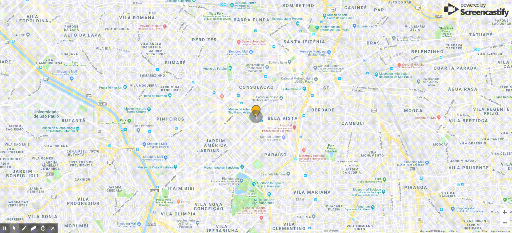
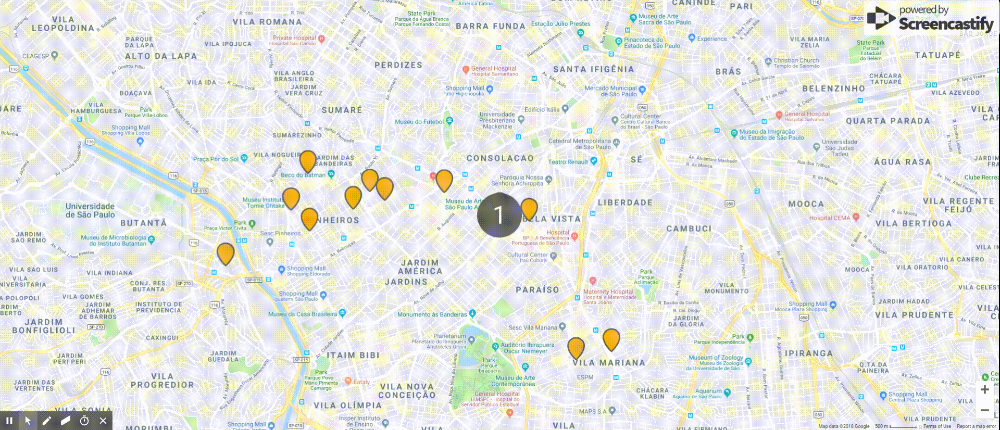
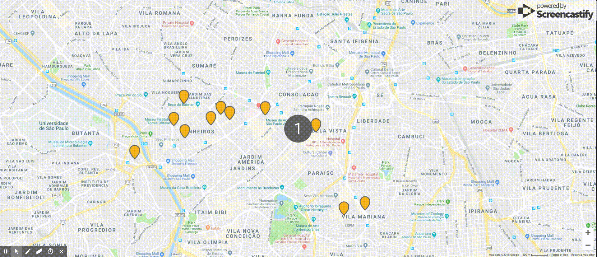
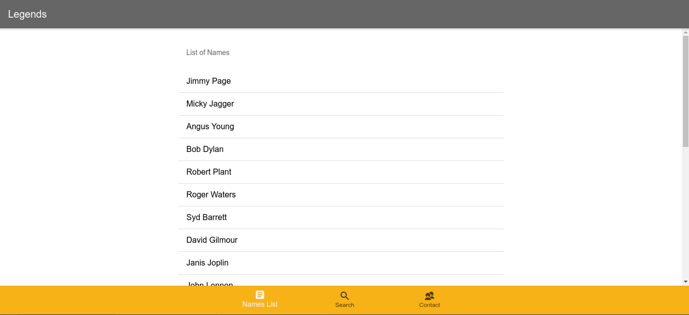
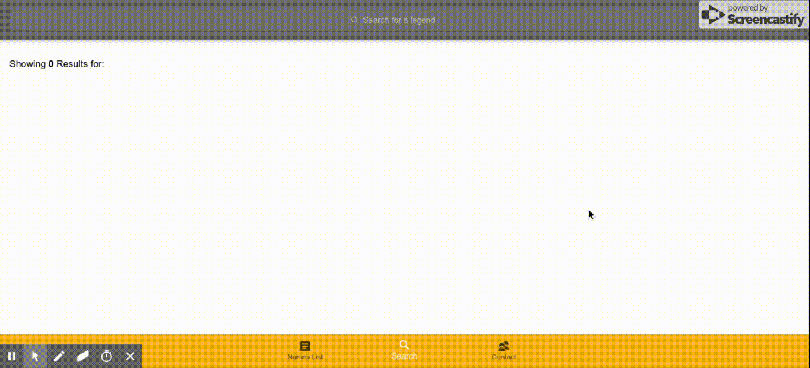
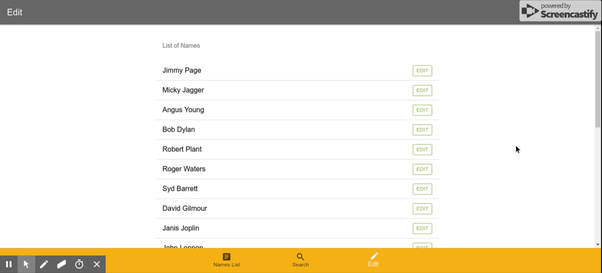
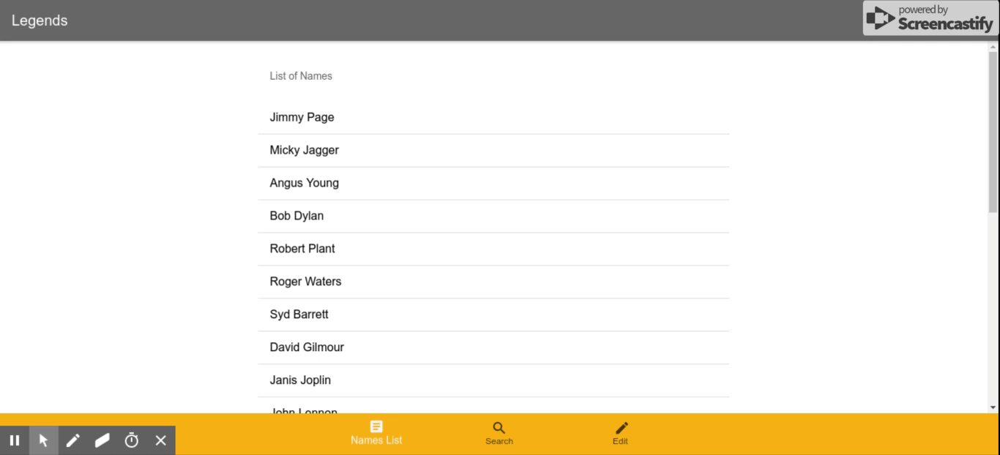
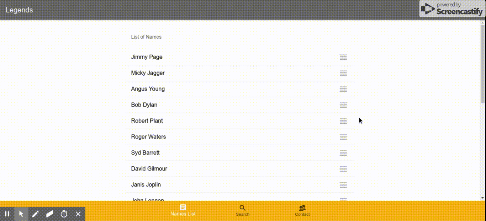

# Inspiring Avaliações Front End

Bem vindo ao repo de avaliações Front End da Stefanini Inspiring. Agradecemos o seu interesse em se juntar a nós, agora leia as instruções com calma e não deixe de evidenciar o seu progresso mesmo que não consiga concluir totalmente algum item. 

Lembre-se que errar é o primeiro passo para o aprendizado e Happy coding.

## Pré Requisitos:
O conhecimento no sistema de versionamento git é um pré requisito para esta avaliação, porém, não deve ser um impeditivo para os que não estão familiarizados com a ferramenta, pois a capacidade de pesquisar e aprender novos conceitos também será avaliada e é um requisito de trabalho em nosso dia a dia.

Ter uma versão do node.js instalada, utilizamos a versão 10.9.0 para os projetos.

## Regras:
Esta avliação é composta por pequenas aplicações já criadas nas quais você deverá adicionar algumas funcionalidades conforme informado.
Também serão feitas algumas questões sobre as aplicações, que deverão ser respondidas.

O formato de entrega da avaliação será feito no github em uma conta de seu nome.
O projeto deverá ser clonado e as modificações deverão ser commitadas para a sua conta do github. 

Para clonar o projeto, utilize os comandos

`git clone https://github.com/StefaniniInspiring/avaliacoes-frontend.git`

`rm -rf .git/`

As questões de funcionalidades, serão avaliadas analisando os commits que você fizer.
As perguntas, deverão ser respondidas no arquivo respostas_README.md.

Antes de commitar o arquivo com as respostas, o arquivo respostas_README.md deverá ser renomeado para README.md.

**Não esqueça de responder na folha de respostas as questões 2, 4 e 6!**

Ao final, preencha o [nosso questionário](https://bit.ly/2QD1gc4) onde terá um local para colar a url do repositório onde você commitou as respostas, não esqueça de informá-lo corretamente.
Link para o questionário: https://bit.ly/2QD1gc4

__Serão avaliados__:
Qualidade do código (lógica, limpeza, identação, dentre outros)
A aplicação está funcional? (É possível rodar a aplicação depois das alterações?)
Resultado das alterações (As alterações feitas levam ao resultado esperado?)
Coerência das respostas (As respostas das perguntas são claras e demonstram entendimento do assunto?)

Observações:
Utilize a frequência de commits que julgar necessária para organizar bem o seu trabalho.

# Parte 01 - Javascript

### Questão 1 - Javascript
Acesse a pasta `avaliacoes-frontend/javascript`

Neste diretório, temos um mapa com alguns pontos de interesse já mapeados no objecto criado com nome placesOfInterest dentro de index.js.
O projeto poderá ser acessado utilizando o servidor http-server do node.js, para executá-lo, você deverá rodar os seguintes comandos em um terminal dentro da pasta do projeto:

`npm install` <--- para instalar as dependências, como o http-server por exemplo

`./node_modules/http-server/bin/http-server .`   <--- para subir o servidor e servir a aplicação 

O site deverá estar acessível em http://localhost:8080

a) A aplicação exibe um marcador de 1 dos pontos de interesse, localizado na Avenida Paulista ao lado do Parque Trianon em frente ao MASP.
Modificque o código da aplicação para que ela passe a exibir todos os pontos de interesse listados no Array 'placesOfInterest'.

b) Modifique a aplicação para alterar a cor do marcador de um ponto de interesse quando este for clicado, conforme exemplo:

c) Modifique a aplicação para abrir uma janela com com o nome do ponto de interesse quando clicado, conforme exemplo:

d) Modifique a aplicação para voltar a cor original do marcador ao fechar a janela, conforme exemplo: 

e) Modifique a aplicação para fechar uma janela de um marcador previamente aberta, quando outra janela for clicada. Também deverá restaurar a cor original do marcador peviamente selecionado, cofnrome exemplo:

Desafio)
Adicione um botão de centralizar mapa, que quando clicado, caso o usuário dê permissão de acessar a localização do navegador, leve o mapa para as coordenadas do usuário.

### Questão 2
Responda na folha de respostas as perguntas sobre o projeto da questão 1:

a) No import da api do google maps no index.html, para que servem as tags async e defer?

b) Para que serve o parâmetro &callback=initMap na url da api do google maps?

c) O que acontece quando removemos o parâmetro &callback=initMap da url da api do google maps? Explique o porque.

d) Descreva pelo menos uma forma de como podemos fazer com que a aplicação funcione corretamente mesmo sem este parâmetro.

e) Explique para que servem as seguintes tags do index.html: 
  `<link rel="manifest" href="manifest.json">
  <meta name="theme-color" content="">
  <meta name="apple-mobile-web-app-capable" content="yes">
  <meta name="apple-mobile-web-app-status-bar-style" content="black">`
  
f) Está aplicação pode ser considerada um PWA? Em caso negativo, explique o que falta para que seja.

# Parte 02 - Angular

A partir de agora, utilizaremos Angular 6 para os projetos. Instale a versão utilizada com o seguinte comando: 
`npm install -g @angular/cli@6.1.1`

### Questão 3

Acesse a pasta `avaliacoes-frontend/angular`

Neste diretório, temos uma aplicação em Angular 6. Para executá-la localmente, execute os comandos

`cd avaliacoes-frontend/angular`

`npm install`

`ng serve`

A aplicação deverá estar acessível em http://localhost:4200

a) Modifique a aplicação para exibir na primeira aba 'Names List' todos os itens listados no arquivo /avaliacoes-frontend/angular/src/app/names/nameslist.ts.
Estes itens deverão ser importados em list.page.ts e exibidos na tela conforme o exemplo abaixo:

b) Na aba 'Search', modifique a aplicação para buscar do arquivo /avaliacoes-frontend/angular/src/app/names/nameslist.ts os nomes que contem parte do texto digitado no campo de busca, conforme exemplo:

Observações: 
- A busca deve ignorar letras maiúsculas
- Ao limpar o campo de busca, deve exibir 0 resultados

c) Na aba 'Edit', modifique a aplicação para buscar do arquivo /avaliacoes-frontend/angular/src/app/names/nameslist.ts e listar na tela, exibindo um botão de editar em cada item, que permite que o nome seja alterado, conforme exemplo abaixo:

d) Faça com que uma alteração na lista da aba 'Edit' seja refletida na aba 'List', conforme exemplo:

Dica, pesquise a API Events, do Ionic Angular

Desafio)
Modifique a primeira aba para permitir que a lista de nomes seja reordenável, conforme exemplo abaixo:

### Questão 4
Responda na folha de respostas as perguntas sobre o projeto da questão 2:

a) Para que serve o método ngOnInit, quais são os outros métodos do Angular lifecycle hooks e para que servem?

b) Neste projeto, estamos usando os componentes gráficos da versão 4 da biblioteca gráfica do Ionic. Nesta versão, os componentes são Web Components.
Explique o que são Web Components e explique quais são as vantagens deles.

c) Para que serve a tag ngFor do angular?

d) O que o codigo abaixo representa no arquivo list.page.ts?
`legends: Array<string> = []`

e) Como funciona a api Events do Ionic? Para que serve?

f) O que é flexbox? Para que servem as tags ion-grid, ion-row, ion-col? Quais as vantagens em utilizálas?

# Parte 03 - Identificar e corrigir problemas
Nesta etapa, será avaliada a habilidade em identificar e corrigir problemas comuns de aplicações.

Para executar esta aplicação, rode os comandos:
`cd avaliacoes-frontend/devops`

`npm install`

`ng serve`

A aplicação deverá estar acessível em http://localhost:4200

### Questão 5

A aplicação apresenta diversos problemas de estrutura de código e de performance.

Faça todas as alterações que julgar necessárias para corrigir e torná-la mais profissional e com uma performance melhor.

Commite as alterações e mensagens com a frquência que julgar necessárias.

### Questão 6
Responda na folha de respostas as perguntas sobre o projeto da questão 5:

a) Quais foram os problemas que você identificou?

b) Ordene os problemas por ordem de criticidade, ou seja, liste todos os problemas encontrados na ordem de quais deveriam ser corrigidos primeiro em um cenário onde devessemos priorizar as correções.

c) Justifique a ordem proposta no item anterior em termos de impacto para os usuários e dificuldade para corrigir o problema.

d) Para que servem os comandos async e await encontrados na função presentLoading do arquivo home.page.ts?

e) Quais as vantagens de utilizar async/await em códigos javascript/typescript?

f) Explique para que serve a seguinte lib encontrada no arquivo home.page.ts
`import * as _ from 'lodash';`

